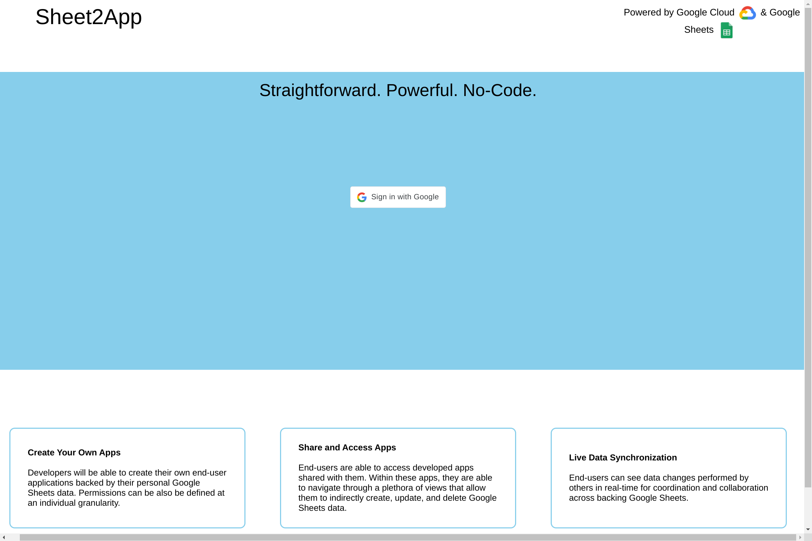

# Sheet2App

Team Penguins presents Sheet2App, a web app that allows users to create web apps with Google Sheets.

## Prerequisites

### Linux

Install Docker and Compose Plugin

* [CLI Only](https://docs.docker.com/compose/install/linux/#install-using-the-repository)
* [Docker Desktop](https://www.docker.com/products/docker-desktop)

### Windows

Install WSL2, Docker Desktop, and VSCode Extensions

1. [WSL2](https://code.visualstudio.com/docs/remote/wsl-tutorial#_install-visual-studio-code)
2. [Docker Desktop](https://learn.microsoft.com/en-us/windows/wsl/tutorials/wsl-containers)

### Both

1. Rename your `server/s2a_api/migrations` folder to something else.
2. Set the OAuth Client ID environment variable in `client/Dockerfile`
3. Set the OAuth Client ID and Secret environment variables in `server/Dockerfile`
4. Store your Google Service Account credentials in `server/sheets/credentials.json`
5. Store your Token in `server/token.json` (for testing purposes only)

## Starting

    docker compose up

This starts everything for you. Add:

* `-d` to start in detached mode,
* `--build` to rebuild the images.

Please wait a moment for the following to become available:

* The client at <http://localhost:3000>,
* The server's admin panel at <http://localhost:8000/admin>,
  * The default username is `admin` with password `password`
* The server's health checks at <http://localhost:8000/ht>.

## Stopping

    docker compose down

This stops everything for you. Add:

* `-v` to remove its volumes,
* `--rmi all` to remove its images,
* `-t 0` to stop immediately.

## Testing

### Frontend

    docker exec -it node npm test

This runs the client's tests in interactive mode. Alternatively, run:

    docker exec node npm test -- --watchAll=false

### Backend

    docker exec django pytest

This runs the backend's tests. Add:

* `-n logical` to run the tests in parallel,
* `-v` for verbose output.

#### Database

You can start a MySQL shell by executing:

    docker exec -it mysql mysql -u root -p Sheet2App

And entering the password `default-password`.

#### Cache

If you started in detached mode, you can monitor Redis with:

    docker exec redis redis-cli monitor

Clear it with:

    docker exec redis redis-cli flushall

> ##### Note
>
> The cache is not persistent. It will be cleared when you stop the app.
